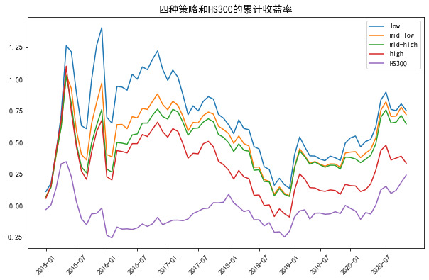

## Multi-factor Sentiment Strategy on A-stocks
- Back-tested a profitable A-share sentiment strategy. Computed emotional factors over 3.2×10^7 HS300/A-share data
- Rollingly sliced the factors. Constructed the sentiment by PCA and summation weighted by explained variance ratios
- Improved CAPM by adding the sentiment. Regressed on the HS300/A-share returns under normal transaction status
- Stratified sentiment beta's. Computed returns and component stocks for the strata. All cumulative returns beat HS300. Lower sensitivity strictly led to higher returns: 0.75/0.72/0.64/0.33, 6 years. Larger firms had more volatile beta's

